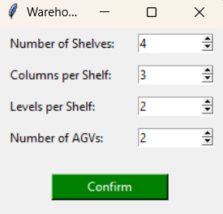
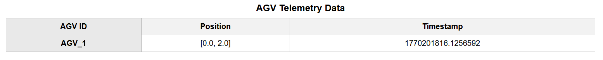
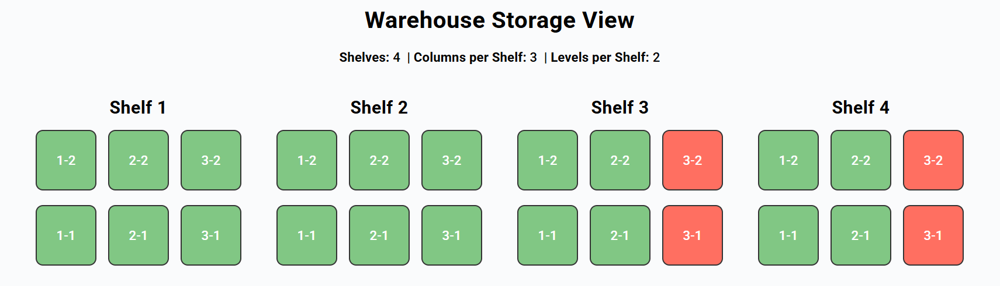
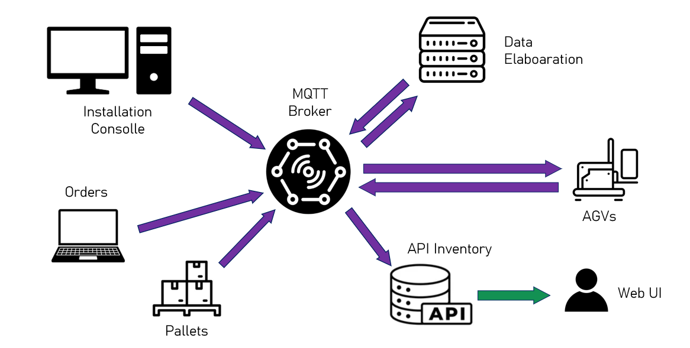

# Distributed & IoT Warehouse Project

## Table of Contents
- [Objective](#objective)
- [Devices Involved](#devices-involved)
- [Architecture](#architecture)
- [Main Components](#main-components)
  - [Data Inputs](#data-inputs)
  - [Data Elaboration](#data-elaboration)
  - [Communication](#communication)
  - [Deployement](#deployement)
- [Dataflow structure](#dataflow-structure)
- [How It Works](#how-it-works)
- [MQTT Topic Mapping](#mqtt-topic-mapping)
- [How to use](#how-to-use)

## Overview
This project simulates and manages a smart warehouse using distributed systems and IoT technologies. It features AGV simulation, slot management and mission scheduling. The architecture is modular, containerized (Docker), and leverages MQTT for communication between services. It also features an HTTP API inventory for the data visualization through Web-ui.

## Objective
The aim of this project is to realise an IoT architecture that can be adaptable and scalable for any kind of warehouse. The system can be easily and quickly deployed without having strict dimensions limits. Its microservices structure makes it really accesible for configuring each service in order to simulate the most simlar scenario to the one that we want to deploy it in. 

## Devices Involved

- **AGVs (Automated Guided Vehicles)**: These are mobile robots responsible for transporting pallets from the end of the production line to storage locations within the warehouse. Each AGV is equipped with:
  - **ToF (Time-of-Flight) sensors**: Used to detect obstacles in the AGV's path, ensuring safe navigation.
  - **Wheel encoders**: Allow the AGV to compute its own position by measuring wheel rotations, enabling precise movement and localization.

- **Weight sensors**: Positioned in the pallet pick-up area, these sensors detect the presence of a pallet ready to be collected by an AGV. They provide real-time feedback to the system about pallet availability at the end of the production line.

- **Orders requests**: Orders arrival can be either from remote costumers or from an internal database.

- **Installation and control consolle**: Device from where the system is deployed and configured.

- **Computation server**: Hardware responsible for data elaboration and storage.

## Architecture
- **Microservices**: Each major function runs in its own container (see Dockerfiles and docker-compose.yaml). Every service in the container runs autonumusly and can be easily configurable without having to change the other modules.
- **MQTT Communication**: All real-time data (slots, AGV telemetry, missions) is exchanged via MQTT topics which is the most suitable protocol for asyncrhonus processes and IoT devices communication like we have in thi application.
- **REST API**: Inventory and telemetry data are exposed via HTTP endpoints for integration and visualization.
- **Web UI**: Connects to the REST API and MQTT broker to provide a user-friendly dashboard.

## Main Components

### Data Inputs
**Warehouse Generator**: <br>
With this module the user can insert the value of 4 parameters to configure the system through a Tkinter user Interface. 
The parameters are values representing: 
  - Number of shelves
  - Number of clomuns per shelf
  - Number of levels per shelf 
  - Number of AGVs

  

These parameters are deisgned to be easily accesible by the user and at the same time to be easily computable data. <br>
[*generate_warehouse.py*](smart_warehouse/warehouse_generator/generate_warehouse.py) takes the four integers and elaborates them with the logic of the WarehouseMatrix and WarehouseGraph classes respectively from [*matrix.py*](smart_warehouse/warehouse_generator/matrix.py) and [*graph.py*](smart_warehouse/warehouse_generator/graph.py). <br>
The result is the generation of several structures of data that are going to set the base characterization for the computational part of the system.

Data generated:
- Adjecny Matrix
- Node types
- Node positions
- Networkx graph in json

After the configuration values are confirmed, the code gives a visualization of the graph representation of the warehouse in order to let the user check the correct submission of the parameters.


This module also takes the responsability of sending both parameters and configuration data to the MQTT broker publishing them on the `warehouse/config` topic level.

**Order Generator**: <br>
The order generator microservice relies only on [*orders.py*](smart_warehouse/order_generator/app/orders.py) which contains the logic that simulates the arrival of orders to send to the shipping zone.

The algorithm creates a configurable number of orders on a 8h time span and distributed with an exponential randomness by assigning to each the arrival timestamp to construct the json:
```json
{
  "order_id": 1,
  "timestamp": 1707051234
}
```
When the measured timestamp from the start of the service reaches the predicted arrival timestamp it publishes the respective order data to `warehouse/order`.

**Pallet Spawner**: <br>
This module simulates the arrival of pallets from an hypothetical line of production which supplies the warehouse continuously.
The scenario is designed to receive the signal from weight sensors positioned at the end of the line, for this reason [*pallet_spawner.py*](smart_warehouse/pallet_spawner/app/pallet_spawner.py) uses the WeightSensor class to "spawn" a pallet every 10 seconds by publishing on `warehouse/pallet` with a json structure like this:
```json
{
  "pallet_arrived": true,
  "weight": 23.5,
  "unit": "kg",
  "timestamp": 1707051234
}
```

### Data Elaboration

**Slot Publisher**: <br>
The main concer of this module is to create the data of the storage slots that compose the warehouse. <br>
It retrieves the three shelf parameters from the broker to calculate the total number of slots and then it arranges the data for each one of them in a json structure like:
```json
{
  "slot_id": 1,
  "col": 1,
  "row": 2,
  "level": 2,
  "in_use": true
}
```
Finally it publishes them all on warehouse/slots/{slot_id}.

**Mission Publisher**: <br>
The mission publisher microservice works by receiving configuration data from the broker like node position and typeand then generating missions for AGVs. It uses the warehouse Networkx graph and matrix data to compute optimal paths for each mission using Dijkstra algorithm.

The logic is based on listening to the topics `warehouse/order` and `warehouse/pallet` for new events. 
When a new order or pallet arrives, the module uses the PalletScheduler class in [*pallet_scheduler.py*](smart_warehouse/mission_publisher/app/pallet_scheduler.py) to find the closest empty or occupied storage slot depending on which topic the signal arrived. After this  it calculates the best route for for the AGV and generates a mission path in form of set of nodes id.

The mission is then appended in a larger set that stores all the missions and published as MQTT message on the topic `warehouse/missions`.

**AGV Simulator**: <br>

AGV Simulator emulate the robot movement and interaction inside the warehouse. Rather than simply processing incoming data, it acts as a virtual AGV, interpreting mission instructions and autonomously traversing the warehouse graph.

When a new mission arrives on `warehouse/missions`, the simulator decodes the assigned path, republisehs the set of missions without the chosen one and begins routing through the warehouse nodes. [*encoder_sesnor.py*](smart_warehouse/agv_simulator/app/encoder_sensor.py) and [*ToF_sesnor.py*](smart_warehouse/agv_simulator/app/ToF_sensor.py) serve to simulate the function of the sensors mounted on the AGVs which are respctively: measuring the position of the AGV and signalling the presence of obstruating objects. The AGV's internal state evolves in real time, reflecting both its physical location and operational status.

Throughout its operation, the simulator emits telemetry updates to `warehouse/agv/{agv_id}/position`. These messages encapsulate the AGV's id, current position, and a timestamp, for example:
```json
{
  "agv_id": "AGV_1",
  "position": [x, y],
  "timestamp": 1707051234.123
}
```
This continuous data stream enables live monitoring and visualization, allowing other modules to react to AGV progress and warehouse changes as they unfold. Slot status and mission completion are updated automatically as the AGV reaches its goals, providing a realistic simulation of warehouse logistics.

### Communication
**Data fetcher**: Module responsable for the transmission of data between the MQTT broker and the API inventory.
In particular the two data transferred are the agv telemetry and the slots status which are respctively taken by subscription to `warehouse/agv/{agv_id}/position` and `warehouse/slots/{slot_id}`.
For the AGV telemetry the code continuously listen to the topic and sends with HTTP updates published separetley in different URLs each AGV.
For the slot status instead the service reads from the topic all the data of all the storage slots and arranges it to a single JSON message sent by HTTP to the API inventory.

**Web UI**: Flask-based interface for visualizing slot usage and AGV telemetry through web UI interfaces reachable with the two URLs:
- http://127.0.0.1:7071/agv/AGV_1/position (AGV id changable)

- http://127.0.0.1:7071/storage_view


**MQTT Broker**: Central message mosquitto MQTT broker for all IoT communications.

**HTTP API**: RESTful API for inventory, used by the web UI.

### Deployement
- **Docker compose**: Folder of necessary files to perform deployement of the conatiners of the microservices.

## Dataflow structure



## How It Works
1. **Warehouse Initialization**: The warehouse is generated with configurable shelves, columns, levels, and AGVs. The structure is published to the MQTT broker to be accesible to the other services.
2. **Order & Pallet Events**: Orders and pallets are generated and managed, triggering AGV missions and slot updates.
3. **Slot Management**: Slot Publisher retreieves the configuration data and creates the storage slots and publish them in order to let the other services alterate their stautus when the simulation needs it.
4. **Mission Scheduling**: Missions are created as set of nodes and published to the broker, path are created with Dijkistra algorithm that ensure otpimal routes and shorter times of movement.
5. **AGV Simulation**: AGVs retrieve the mission set and takes the first mission then republishes the set without the chosen mission, navigate the warehouse graph, interact with sensors (ToF, encoders), and update their status.
6. **Data Fetcher**: It continuosly transmits the slots status and agv position to the API inventory to make data accessible for the web server.
7. **Web Visualization**: The web UI displays a live slot status (color-coded), AGV positions, and configuration parameters letting the user intercat with the warehouse in real-time.


## MQTT Topic Mapping

Below is a mapping of the main MQTT topics used in the Distributed & IoT Warehouse Project. These topics enable communication between microservices for real-time warehouse management.


| Topic Name                                   | Publisher           | Subscriber(s)         | Payload Description                          | QoS | Retain |
|----------------------------------------------|---------------------|-----------------------|----------------------------------------------|-----|--------|
| `warehouse/config`                           | warehouse_generator | all services          | Warehouse configuration            |  N/D|  N/D   |
| `warehouse/config/param/number_of_shelves`   | warehouse_generator | all services          | Number of shelves parameter                  |  1|  True   |
| `warehouse/config/param/columns_per_shelf`   | warehouse_generator | all services          | Columns per shelf parameter                  |  1|  True   |
| `warehouse/config/param/levels_per_shelf`    | warehouse_generator | all services          | Levels per shelf parameter                   |  1|  True   |
| `warehouse/config/param/number_of_agvs`      | warehouse_generator | all services          | Number of AGVs parameter                     |  1|  True   |
| `warehouse/config/adjacency_matrix`          | warehouse_generator | all services          | Adjacency matrix of warehouse graph          |  1|  Flase   |
| `warehouse/config/node_positions`            | warehouse_generator | all services          | Node positions in the warehouse              |  1|  Flase   |
| `warehouse/config/agv_start_nodes`           | warehouse_generator | all services          | AGV start node indices                       |  1|  False   |
| `warehouse/config/shipping_nodes`            | warehouse_generator | all services          | Shipping node indices                        |  1|  False   |
| `warehouse/config/pallet_spawn_nodes`        | warehouse_generator | all services          | Pallet spawn node indices                    |  1|  False   |
| `warehouse/config/shelf_nodes`               | warehouse_generator | all services          | Shelf node indices                           |  1|  False   |
| `warehouse/config/graph_json`                | warehouse_generator | all services          | NetworkX graph as JSON (nodes, links)        |  1|  False   |
| `warehouse/missions`                     | mission_publisher     | agv_simulator | Set of mission paths          |  1|  False   |
| `warehouse/slots/{slot_id}`                     | slots_publisher     | agv_simulator,data_fetcher | Slot status updates (occupied/free)          |  1|  False   |
| `warehouse/slots/total`                     | slots_publisher     | agv_simulator | Total number of slots         |  1|  False   |
| `warehouse/agv/{agv_id}/position`                      | agv_simulator   | data_fetcher         |   AGV position       |  0|  False   |
| `warehouse/order`                        | order_generator     | mission_publisher     | New order event                              |  1|  False   |
| `warehouse/pallet`                     | pallet_spawner      | mission_publisher     | Pallet spawn event                           |  1|  False   |

## How to use
1. Start all containers with Docker Compose.
2. Run [*generate_warehouse.py*](smart_warehouse/warehouse_generator/generate_warehouse.py), it will open the configuration ui.
3. Insert and submit the 4 parameters by pressing the confirm button.
4. At this point the graph representation of the warehouse based on the parameters should appear, when you are done checking the correctness of the data you can close the window.
5. Wait for the confirmed publishing message in the terminal, whenever it appears the system will start generating orders and pallets.
6. In a few seconds you will see from the logs on the docker the trasnsmission of data between services.
7. while the system is fully running you can check on the two web user interfaces:
  - on http://127.0.0.1:7071/storage_view to view the storage slot current status,
  - on http://127.0.0.1:7071/agv/AGV_1/position to check on the position of a specific AGV, its is possible to change the target agv by changing the agv id.